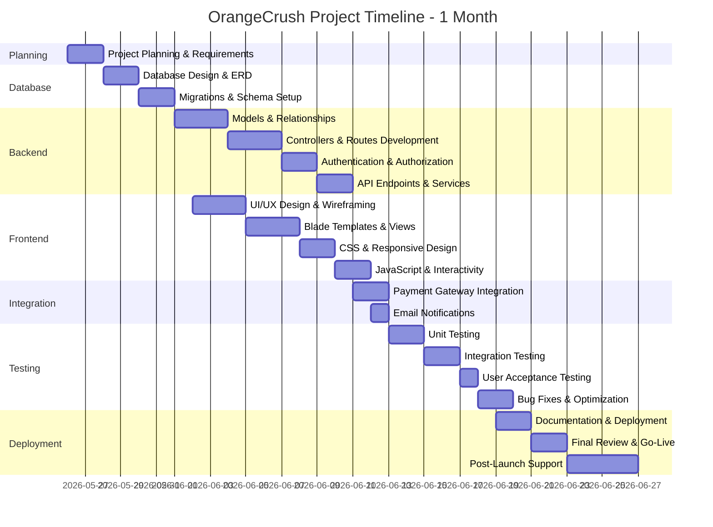
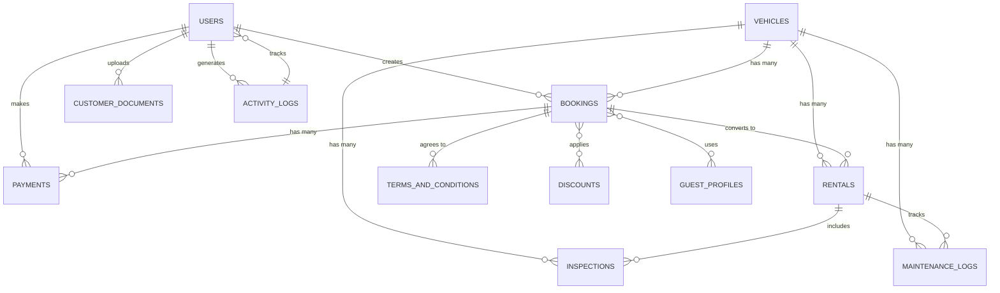

# OrangeCrush Car Rental Platform - Project Documentation

## I. PROJECT OVERVIEW

**Project Name:** OrangeCrush Car Rental Platform  
**Current Date:** May 26, 2026  
**Duration:** 1 Month (May 26 - June 26, 2026)  
**Technology Stack:**
- Backend: Laravel 11 (PHP)
- Frontend: Blade Templates, Vue.js
- Database: MySQL
- Mobile: Flutter
- Payment Integration: GCash

---

## II. GANTT CHART (1-Month Timeline)



### Project Phases:

| Phase | Duration | Start Date | End Date | Status |
|-------|----------|-----------|----------|--------|
| **Planning** | 2 days | May 26 | May 27 | ✅ Completed |
| **Database Design** | 4 days | May 28 | May 31 | ✅ Completed |
| **Backend Development** | 8 days | Jun 1 | Jun 8 | 🔄 In Progress |
| **Frontend Development** | 8 days | Jun 2 | Jun 9 | 🔄 In Progress |
| **Integration** | 3 days | Jun 11 | Jun 13 | ⏳ Upcoming |
| **Testing** | 7 days | Jun 13 | Jun 19 | ⏳ Upcoming |
| **Deployment** | 8 days | Jun 19 | Jun 26 | ⏳ Upcoming |

---

## III. ENTITY RELATIONSHIP DIAGRAM (ERD)

### Main Entities and Relationships



### Entity Details

#### **USERS** (Customers, Admins, Super Admins)
```
Attributes:
- id (PK)
- first_name
- last_name
- email (UNIQUE)
- phone
- password
- status (active, suspended, inactive)
- verification_status
- loyalty_points
- last_login_at
- created_at
- updated_at
```

#### **VEHICLES**
```
Attributes:
- id (PK)
- name
- brand
- model
- year
- plate_number (UNIQUE)
- type (Sedan, SUV, Pickup Truck, Van, Hatchback, Crossover)
- transmission (Automatic, Manual)
- fuel (Gasoline, Diesel, Electric, Hybrid)
- capacity (passenger count)
- price_per_day
- status (available, rented, maintenance, unavailable)
- description
- image
- created_at
- updated_at
```

#### **BOOKINGS**
```
Attributes:
- id (PK)
- user_id (FK → USERS)
- guest_profile_id (FK → GUEST_PROFILES)
- vehicle_id (FK → VEHICLES)
- first_name
- last_name
- email
- phone
- drivers_license_number
- pickup_date
- return_date
- actual_return_date
- total_amount
- discount_amount
- late_fee
- security_deposit
- security_deposit_status
- refueling_fee
- status (pending_payment, awaiting_verification, confirmed, rejected, ongoing, completed, cancelled)
- terms_agreed_at
- rejection_reason
- admin_notes
- hold_expires_at
- cancellation_reason
- cancelled_by
- cancelled_at
- created_at
- updated_at
```

#### **PAYMENTS**
```
Attributes:
- id (PK)
- booking_id (FK → BOOKINGS)
- amount
- amount_submitted
- payment_method (gcash)
- reference_code
- gcash_transaction_reference_number (UNIQUE)
- gcash_account_name
- screenshot_path
- status (pending, verified, rejected)
- verified_by (FK → USERS)
- created_at
- updated_at
```

#### **RENTALS**
```
Attributes:
- id (PK)
- booking_id (FK → BOOKINGS)
- vehicle_id (FK → VEHICLES)
- user_id (FK → USERS)
- pickup_odometer
- return_odometer
- status (in_progress, returned, completed)
- created_at
- updated_at
```

#### **CUSTOMER_DOCUMENTS**
```
Attributes:
- id (PK)
- user_id (FK → USERS)
- document_type (Driver's License, ID, etc.)
- file_path
- status (pending, approved, rejected)
- created_at
- updated_at
```

#### **DISCOUNTS**
```
Attributes:
- id (PK)
- code (UNIQUE)
- type (percent, fixed)
- value
- usage_limit
- times_used
- created_at
- updated_at
```

#### **ACTIVITY_LOGS**
```
Attributes:
- id (PK)
- user_id (FK → USERS)
- action (description of action)
- model_type (model name)
- model_id (related record ID)
- created_at
```

#### **INSPECTIONS**
```
Attributes:
- id (PK)
- rental_id (FK → RENTALS)
- condition (good, minor_damage, major_damage)
- notes
- created_at
- updated_at
```

#### **MAINTENANCE_LOGS**
```
Attributes:
- id (PK)
- vehicle_id (FK → VEHICLES)
- rental_id (FK → RENTALS, nullable)
- issue_description
- status (pending, in_progress, completed)
- cost
- created_at
- updated_at
```

#### **GUEST_PROFILES**
```
Attributes:
- id (PK)
- user_id (FK → USERS)
- first_name
- last_name
- email
- phone
- drivers_license_number
- created_at
- updated_at
```

#### **TERMS_AND_CONDITIONS**
```
Attributes:
- id (PK)
- content (text)
- version
- is_current (boolean)
- created_at
- updated_at
```

---

## IV. USER INTERFACE MANUAL

### A. Public User Journey

#### 1. **Homepage** (`/`)
**Navigation:** Entry point for all users
- Display 6 featured vehicles
- Show statistics: Total vehicles, customers, bookings, revenue
- Call-to-action buttons: "Browse Vehicles", "Login", "Register"

**Components:**
- Navigation bar with logo, menu links
- Hero section with booking preview
- Featured vehicles carousel
- Statistics dashboard
- Footer with contact info

---

#### 2. **Vehicle Browsing** (`/vehicles`)
**Navigation:** After clicking "Browse Vehicles"
- View all available vehicles with filters
- Search by type, brand, price range
- Sort by price, ratings, availability
- Click vehicle card for details

**Components:**
- Search & filter form
- Vehicle grid/cards (responsive)
- Vehicle details modal or separate page
- Availability calendar
- "Book Now" button

---

### B. Customer User Journey

#### 1. **Registration** (`/register`)
**Navigation:** Click "Register" on homepage
**Steps:**
1. Enter: First Name, Last Name, Email, Phone
2. Set Password (min 8 characters)
3. Confirm Password
4. Click "Create Account"

**Output:** Redirects to customer dashboard

**Components:**
- Form with validation feedback
- Password strength indicator
- "Already have an account?" login link

---

#### 2. **Login** (`/login`)
**Navigation:** Click "Login" on homepage
**Steps:**
1. Enter email & password
2. Optional: "Remember me" checkbox
3. Click "Sign In"

**Output:** Redirects to customer dashboard

**Components:**
- Email input field
- Password input field
- Remember me checkbox
- "Forgot Password?" link
- Submit button

---

#### 3. **Customer Dashboard** (`/customer/dashboard`)
**Navigation:** After successful login (customers redirected here)
**Purpose:** Central hub for all customer activities

**Main Sections:**
- **Welcome Banner:** "Welcome, [Name]! Manage your car rentals below"
- **Quick Stats:** 
  - Active bookings count
  - Loyalty points balance
  - Recent transactions
- **Active Bookings Table:**
  - Booking ID, Vehicle, Dates, Status
  - Action buttons: View, Pay, Track, Cancel
- **Quick Actions:**
  - "Book a Vehicle" button
  - "View All Bookings" link
  - "My Payments" link
  - "My Profile" link

**Components:**
- Navigation sidebar with menu
- Stats cards
- Bookings data table
- Status badges (color-coded)
- Action buttons

---

#### 4. **Create Booking** (`/customer/booking/create`)
**Navigation:** Click "Book Now" on vehicle or "Book a Vehicle" on dashboard
**Verification Check:** Must have uploaded driver's license

**Step-by-Step Form:**
1. **Vehicle Selection:** (Pre-selected or choose)
2. **Pickup & Return Dates:** Date pickers (after today)
3. **Personal Information:**
   - First Name (required)
   - Last Name (required)
   - Email (required)
   - Phone (required)
4. **Pricing Preview:**
   - Daily rate displayed
   - Number of days calculated
   - Base price = rate × days
   - Smart pricing adjustment (if peak season)
   - Discount code input (optional)
   - Security deposit: ₱3,000
   - **Total Amount** displayed
5. **Terms & Conditions:** Checkbox to agree
6. **Submit:** "Confirm Booking" button

**Output:** 
- If verified: Status = "Pending Payment" (1 hour hold)
- If not verified: Status = "Awaiting Approval"
- Redirects to tracking page with success message

**Components:**
- Multi-step form with progress indicator
- Date range picker
- Price calculator (real-time update)
- Discount code validator
- Terms & conditions modal
- Submit/Cancel buttons

---

#### 5. **Payment Page** (`/customer/payment/{booking}`)
**Navigation:** Click "Pay Now" from booking or tracking page
**Prerequisite:** Booking status = "Pending Payment" and hold not expired

**Payment Form:**
1. **Booking Summary:**
   - Vehicle details
   - Pickup/return dates
   - Amount due
   - Security deposit
   - **Balance to pay** calculated
2. **Payment Details:**
   - GCash Transaction Reference (required)
   - GCash Account Name (optional)
   - Amount Submitted (required, validate against balance)
   - Screenshot Upload (required, max 5MB)
3. **Submit:** "Submit Payment" button

**Output:** 
- Payment status: "Pending Verification"
- Success message: "Payment submitted! We'll verify it shortly."
- Redirects to tracking page

**Components:**
- Booking summary card
- Form fields with validation
- File upload input
- Submit button
- Help text explaining GCash payment process

---

#### 6. **Booking Tracking** (`/customer/tracking`)
**Navigation:** After booking creation or from dashboard
**Purpose:** View all bookings and their statuses

**Booking List:**
- Table with columns:
  - Booking ID
  - Vehicle Name
  - Pickup Date
  - Return Date
  - Status (color-coded badge)
  - Amount
  - Actions
- Status indicators:
  - 🟡 Pending Payment
  - 🔵 Awaiting Verification
  - 🟢 Confirmed
  - 🔴 Rejected/Cancelled
  - 🟠 Ongoing
  - ✅ Completed

**Action Buttons per Status:**
- Pending Payment → "Pay Now", "Cancel"
- Awaiting Verification → "View Details", "Resend"
- Confirmed → "View Details", "Track"
- Ongoing → "View Details", "Report Issue"
- Completed → "View Details", "Review", "Rebook"

**Components:**
- Booking table
- Status badges
- Filter/sort options
- Action buttons
- Details modal

---

#### 7. **Profile Management** (`/customer/profile`)
**Navigation:** Click profile icon or "My Profile" link
**Purpose:** Manage personal information and documents

**Sections:**
1. **Personal Information:**
   - First Name (editable)
   - Last Name (editable)
   - Email (read-only)
   - Phone (editable)
   - Save button
2. **Documents:**
   - Upload Driver's License
   - Upload ID
   - Document status (pending, approved, rejected)
   - Re-upload option
3. **Account Settings:**
   - Password change
   - Privacy settings
   - Notification preferences

**Components:**
- Profile form
- File upload area (with drag-drop)
- Document status indicators
- Edit/Save buttons
- Settings toggles

---

### C. Admin User Journey

#### 1. **Admin Dashboard** (`/admin/dashboard`)
**Navigation:** After admin login
**Purpose:** Overview of business metrics and operations

**Sections:**
- **Key Metrics Cards:**
  - Total Revenue (today/month/year)
  - Active Bookings
  - Pending Payments
  - Available Vehicles
  - Total Customers
- **Charts:**
  - Revenue trend (line chart)
  - Booking status breakdown (pie chart)
- **Recent Activity Feed:**
  - Latest bookings, payments, returns
- **Alerts:**
  - Payment verification pending
  - Overdue returns
  - Maintenance due
- **Quick Actions:**
  - Verify Payment
  - Approve Booking
  - View Reports

**Components:**
- Metric cards
- Charts (Chart.js or similar)
- Activity feed
- Alert notifications
- Quick action buttons

---

#### 2. **Booking Management** (`/admin/bookings`)
**Navigation:** From dashboard or admin menu
**Purpose:** Review and manage all bookings

**Features:**
- Table with all bookings (sortable, filterable)
- Columns: ID, Customer, Vehicle, Dates, Status, Amount
- Filter by status, date range, customer
- Action buttons:
  - "Approve" (for awaiting_approval)
  - "Reject" (with reason input)
  - "View Details"
  - "View Payment"
  - "Edit Notes"
- Bulk actions (approve multiple, export)

**Details Modal:**
- Customer info
- Vehicle details
- Booking dates & amount
- Payment details
- Admin notes field
- Action buttons

**Components:**
- Data table with filters
- Status badges
- Action buttons
- Details modal
- Bulk actions dropdown

---

#### 3. **Payment Verification** (`/admin/payment-verification`)
**Navigation:** From dashboard alerts or admin menu
**Purpose:** Verify customer payment screenshots

**Payment List:**
- Table with pending payments
- Columns: ID, Customer, Booking, Amount, Date Submitted, Actions
- Filter by status
- Action buttons:
  - "Verify" (mark as verified, booking → confirmed)
  - "Reject" (with reason, create notification)
  - "View Screenshot" (modal with enlarged image)

**Verification Steps:**
1. Click payment row
2. View screenshot and details
3. Confirm amount matches booking balance
4. Click "Verify" or "Reject"
5. Add notes (optional)
6. Submit

**Components:**
- Payment table
- Image viewer modal
- Verify/Reject buttons
- Notes field
- Success/error messages

---

#### 4. **Return Processing** (`/admin/return-processing`)
**Navigation:** From dashboard or admin menu
**Purpose:** Process vehicle returns and inspect conditions

**Process Steps:**
1. Select "Ongoing" rental from list
2. Enter return details:
   - Return odometer reading
   - Vehicle condition (good, minor_damage, major_damage)
   - Damage notes (if any)
   - Refueling needed? (yes/no)
3. Calculate fees:
   - Late fee (if returned after date)
   - Refueling charge (if applicable)
4. Security deposit:
   - Refund amount (deduct damage/late fees)
5. Submit → Booking status = "Completed"

**Components:**
- Rental list
- Return form
- Condition dropdown
- Notes textarea
- Fee calculator
- Damage photo upload
- Submit button

---

#### 5. **Vehicle Management** (`/admin/vehicles`)
**Navigation:** From admin menu
**Purpose:** Manage vehicle fleet

**Features:**
- Table of all vehicles
- Columns: ID, Name, Plate, Type, Status, Price/day, Actions
- Action buttons:
  - "Edit" (modify details, price, status)
  - "View Bookings" (see booking history)
  - "Maintenance" (add maintenance log)
  - "Delete"
- Add new vehicle button
- Filter by status, type

**Edit Vehicle:**
- Name, brand, model, year
- Plate number
- Type, transmission, fuel
- Capacity, price per day
- Status dropdown
- Description
- Image upload
- Save/Cancel buttons

**Components:**
- Vehicle table
- Edit modal/form
- Add vehicle button
- Status indicator
- Maintenance quick-link
- Filter options

---

#### 6. **Activity Logs** (`/admin/activity-logs`)
**Navigation:** From admin menu (optional, for super admin)
**Purpose:** Audit trail of all system activities

**Features:**
- Table with chronological logs
- Columns: Timestamp, User, Action, Model, Details
- Filter by user, action type, date range
- Search functionality
- Export to CSV

**Components:**
- Activity log table
- Date range filter
- Search bar
- Export button
- Activity detail modal

---

### D. Navigation & Menu Structure

#### Customer Menu:
```
Dashboard
├── View Bookings
├── Browse Vehicles
├── Book a Vehicle
├── My Payments
├── My Transactions
├── Profile
│   ├── Edit Profile
│   ├── Upload Documents
│   └── Account Settings
└── Logout
```

#### Admin Menu:
```
Dashboard
├── Bookings
│   ├── All Bookings
│   ├── Pending Approval
│   └── View Details
├── Payments
│   └── Payment Verification
├── Returns
│   └── Return Processing
├── Vehicles
│   ├── All Vehicles
│   ├── Add Vehicle
│   └── Maintenance
├── Customers
│   ├── All Users
│   └── Reports
├── Activity Logs
└── Logout
```

---

### E. Notifications & Alerts

**Email Notifications:**
- Booking confirmed
- Payment verified
- Booking rejected
- Return confirmed
- Identity verification updated

**In-App Notifications:**
- Booking status changes
- Payment verification status
- Return inspections
- Maintenance tasks

**Alert Types:**
- Success (green): Booking created, payment verified
- Error (red): Payment failed, booking rejected
- Warning (yellow): Hold expiring, overdue return
- Info (blue): Booking pending, awaiting verification

---

### F. Key Interface Components

**Forms:**
- Input validation (real-time feedback)
- Required field indicators (*)
- Help text below fields
- Error messages above field
- Submit/Cancel buttons

**Tables:**
- Sortable headers (↑↓ indicators)
- Pagination (10, 25, 50 items per page)
- Row hover effect
- Checkbox for bulk actions
- Search/filter bar above table

**Modals:**
- Close button (X)
- Title
- Content
- Action buttons (Save/Cancel or OK/Cancel)
- Overlay background

**Status Badges:**
- Color-coded by status
- Rounded pill shape
- Readable text

**Buttons:**
- Primary (blue): Main action
- Secondary (gray): Alternative action
- Danger (red): Delete, cancel booking
- Success (green): Confirm, approve

---

## V. SYSTEM WORKFLOWS

### A. Complete Booking Workflow
```
1. Customer Visits Homepage
   ↓
2. Browse Vehicles / View Details
   ↓
3. Click "Book Now"
   ↓
4. Enter Booking Details
   ↓
5. Review Pricing & Discounts
   ↓
6. Accept Terms & Submit
   ↓
7. If Verified → Status: Pending Payment (1 hour hold)
   OR If Not Verified → Status: Awaiting Admin Approval
   ↓
8. Pay (GCash Payment)
   ↓
9. Admin Verifies Payment
   ↓
10. Booking Confirmed
   ↓
11. Customer Picks Up Vehicle
   ↓
12. Rental: Ongoing
   ↓
13. Customer Returns Vehicle
   ↓
14. Admin Inspects & Processes Return
   ↓
15. Calculate Fees (late, damage, refuel)
   ↓
16. Release Security Deposit
   ↓
17. Booking: Completed
   ↓
18. Customer Receives Loyalty Points
```

### B. Payment Verification Workflow
```
1. Customer Submits Payment
   ↓
2. Status: Awaiting Verification
   ↓
3. Admin Reviews Screenshot
   ↓
4. Admin Confirms Amount Match
   ↓
5. Admin Clicks "Verify"
   ↓
6. Payment: Verified
   ↓
7. Booking: Confirmed
   ↓
8. Email Notification Sent to Customer
```

### C. Return Processing Workflow
```
1. Booking: Ongoing (vehicle rented)
   ↓
2. Customer Returns Vehicle
   ↓
3. Admin Enters Return Details
   ↓
4. Calculate Fees (if late/damaged/refuel needed)
   ↓
5. Calculate Security Deposit Refund
   ↓
6. Update Rental Status: Returned
   ↓
7. Update Booking Status: Completed
   ↓
8. Vehicle Status: Available
   ↓
9. Send Completion Email to Customer
```

---

## VI. KEY FEATURES SUMMARY

| Feature | Customer Access | Admin Access |
|---------|-----------------|--------------|
| Browse Vehicles | ✅ | ✅ |
| Create Booking | ✅ | ❌ |
| Make Payment | ✅ | ❌ |
| Verify Payment | ❌ | ✅ |
| Track Booking | ✅ | ✅ |
| Approve Booking | ❌ | ✅ |
| Process Return | ❌ | ✅ |
| View Dashboard | ✅ | ✅ |
| Manage Vehicles | ❌ | ✅ |
| View Reports | ❌ | ✅ |
| Manage Users | ❌ | ✅ (Admin) |
| Activity Logs | ❌ | ✅ (SuperAdmin) |

---

## VII. DEPLOYMENT CHECKLIST

### Pre-Launch (Final Days)
- [ ] Database backups configured
- [ ] All tests passing (unit, integration, UAT)
- [ ] Performance testing completed
- [ ] Security audit completed
- [ ] SSL certificate installed
- [ ] Email service configured
- [ ] Payment gateway (GCash) tested
- [ ] Error logging configured
- [ ] Monitoring tools set up
- [ ] User documentation ready
- [ ] Admin documentation ready

### Launch Day
- [ ] Final database migration
- [ ] Environment variables set
- [ ] Application deployed
- [ ] All URLs tested
- [ ] Email notifications tested
- [ ] Payment flow tested
- [ ] Go-live announcement sent
- [ ] Support team briefed

### Post-Launch
- [ ] Monitor error logs
- [ ] Monitor performance metrics
- [ ] Collect user feedback
- [ ] Fix critical bugs immediately
- [ ] Plan future enhancements

---

## VIII. CONTACT & SUPPORT

**Technical Support:** [support@orangecrush.com](mailto:support@orangecrush.com)  
**Admin Dashboard:** [admin.orangecrush.com](https://admin.orangecrush.com)  
**Customer Portal:** [orangecrush.com](https://orangecrush.com)

---

*Last Updated: May 26, 2026*
